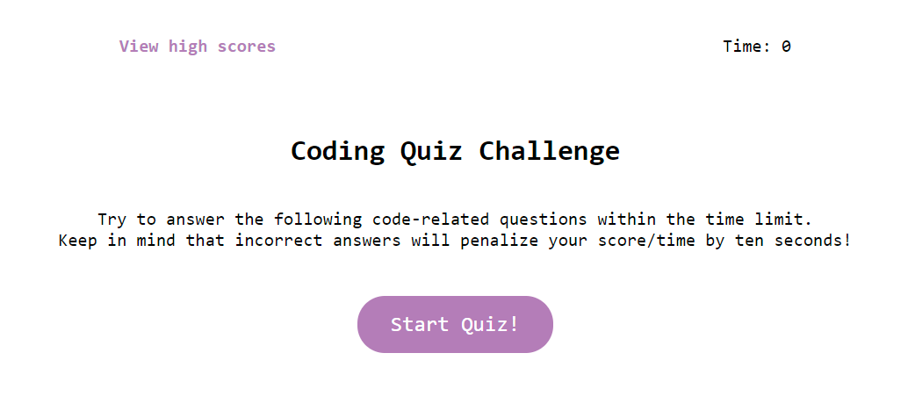

# Timed Quiz

## Description

This simple quiz was designed as a fun way to test a beginner's knowledge of Javascript fundamentals through a series of timed questions. Working on this project taught me a lot about event handlers and how to leverage iterative loops and functions to greater effect.

## Installation
N/A 

## Usage 

Open <a href="https://abbyjo.github.io/quiz-me/">this link</a> in your favorite browser to open the quiz! 
Upon clicking the start button the timer will begin counting down and the quiz will officially start. For each question, once an answer is clicked you will be taken to the next one and the correctness of your prior choice will be displayed at the bottom of each new question. For every incorrect answer 10 points will be deducted from both the time remaining and your total score. Once the quiz is complete you can save your most recent score and try again~   
 
  

## Credits 

Fellow classmate, Carlos Baca, helped me to realize a better way to include questions and answers within the quiz. The method I used to store questions within the JS file initially was from him!   
<a href="https://www.youtube.com/watch?v=PBcqGxrr9g8&ab_channel=GreatStack">This tutorial</a> helped me figure out a lot of the logic for iterating through different qustions, validating the correctness of an answer and much more! It was incredibly helpful throughout this project! 
<a href="https://stackoverflow.com/questions/21700364/adding-click-event-listener-to-elements-with-the-same-class">This post on Stack Overflow</a> helped me figure out how to add event listeners to each answer button! 

## License
MIT License
